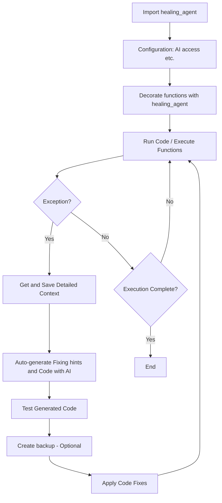

# Healing Agent 🩺

Healing Agent is an intelligent code assistant that automatically detects and fixes errors in your Python code. It leverages the power of AI to provide smart suggestions and corrections, helping you write more robust and error-free code.

⚠️ Not intended for production use. Be extra careful with it, as although it could make backups of your code, it might not always do so correctly, and actually changes your code. ⚠️

Goal: first autonomous actually usable coding agent in production (after Cursor AI)?

## Features ✨

- 🚨 Automatic error detection and handling of diverse exception types
- 💡 Smart error analysis and solution suggestions
- 🔍 Comprehensive error analysis including exception details, stack traces, variables and root cause identification
- 🧠 Advanced AI-powered code healing using LLMs of different providers
- 🔧 Zero-config integration with Python projects
- 💾 Robust error tracking and debugging:
  - Exception context saved to JSON (code, error details, function info and args)
  - Automatic code backups before fixes
  - Detailed analysis results and fix history
  - Quick test of fixes
- 🤖 Fully automated operation with minimal human intervention

## How it works 🧠


## Installation 💻

To install Healing Agent, follow these steps:

PIP package from GitHub:

```bash
pip install git+https://github.com/matebenyovszky/healing-agent
```

OR from source:

1. Clone the repository:
   ```bash
   git clone https://github.com/matebenyovszky/healing-agent.git
   ```

2. Navigate to the project directory:
   ```bash
   cd healing-agent
   ```

3. Install:
   ```bash
   pip install -e .
   ```
   OR run overall test to install and test functionality:
   ```bash
   python scripts/overall_test.py
   ```

## Usage 🔧

To use Healing Agent in your project, follow these steps:

1. Import the `healing_agent` decorator in your Python file:
   ```python
   import healing_agent
   ```

2. Decorate the function you want to monitor with `@healing_agent`:
   ```python
   @healing_agent
   def your_function():
       # Your code here
   ```
   You can also pass parameters to the decorator to change the behavior set in the config file:
   ```python
   @healing_agent(AUTO_FIX=False)
   def your_function():
       # Your code here
   ```

3. Run your Python script as usual. Healing Agent will automatically detect and attempt to fix any errors that occur within the decorated function.

## Configuration ⚙️

Healing Agent is designed to be highly customizable. It leverages `healing_agent_config.py` to define the AI provider and its corresponding API keys. Upon initialization, Healing Agent automatically attempts to load the configuration from `healing_agent_config.py`. If this file does not exist, it defaults to the pre-defined configuration. Additionally, if `healing_agent_config.py` is missing, Healing Agent automatically creates configuration in the default user directory, ensuring a seamless setup process.

You have to configure AI provider and API keys. It supports OpenAI, Azure OpenAI and LiteLLM, Anthropic, and Ollama - however I have only tested Azure OpenAI yet.

## Testing 🧪

To test Healing Agent, you can use the `scripts/test_file_generator.py` script to generate test files in the `tests` directory. `overall_test.py` will run all tests and provide a report on the functionality of Healing Agent.

## Use Cases 💡

- **Development**: Use Healing Agent during development to catch and fix errors early, and let AI generate fixes for your code. This is what you would do anyways, but now it's automated. 😁
- **Educational Tool**: Use Healing Agent as a learning tool to understand AI coding capabilities and limitations.

## License 📜

Healing Agent is distributed under the MIT License. See `LICENSE` for more information.