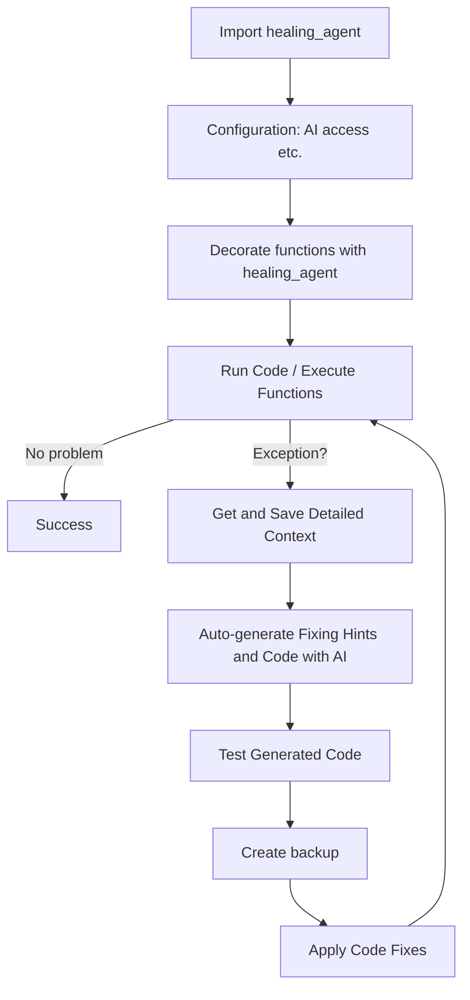

# Healing Agent 🩺

Healer Agent is an intelligent code assistant that catches with detailed context and fixes errors in your Python code. It leverages the power of AI to provide smart suggestions and corrections, helping you write more robust and "self-healing" code. Your program will be able to fix itself, it will have regenerative healing abilities like [Wolverine](https://github.com/biobootloader/wolverine). 

⚠️ Not intended for production use. Be extra careful with the optional AUTO_FIX function, as although it makes backups of your code, it actually changes and runs your code. ⚠️

Goal: first actually usable autonomous coding agent in production

[Video demo on Youtube](https://youtu.be/_N1G3qBO34s)

## Features ✨

- 🚨 Automatic error detection and handling of diverse exception types
- 💡 Smart error analysis and solution suggestions (auto-generated fixing hints and code)
- 🔍 Comprehensive error analysis including exception details, stack traces, local and globalvariables and root cause identification
- 🧠 Advanced AI-powered code healing using LLMs of different providers
- 🔧 Zero-config integration with Python projects (just import and decorate)
- 💾 Robust error tracking and debugging:
  - Exception context saved to JSON (code, error details, function info and args)
  - Automatic code backups before fixes
  - Detailed analysis results and fix history
  - Quick test of fixes
- 🤖 (Optionally) Fully automated operation with minimal human intervention
- 📦 Automatic installation of missing modules

## How it works 🧠



## Installation 💻

To install Healing Agent, follow these steps:

PIP package from GitHub:

```bash
pip install git+https://github.com/matebenyovszky/healing-agent
```

OR from source:

1. Clone the repository:
   ```bash
   git clone https://github.com/matebenyovszky/healing-agent.git
   ```

2. Navigate to the project directory:
   ```bash
   cd healing-agent
   ```

3. Install:
   ```bash
   pip install -e .
   ```
   OR run overall test to install and test functionality:
   ```bash
   python scripts/overall_test.py
   ```

## Usage 🔧

To use Healing Agent in your project, follow these steps:

1. Import the `healing_agent` decorator in your Python file:
   ```python
   import healing_agent
   ```

2. Decorate the function you want to monitor with `@healing_agent`:
   ```python
   @healing_agent
   def your_function():
       # Your code here
   ```
   You can also pass parameters to the decorator to change the behavior set in the config file:
   ```python
   @healing_agent(AUTO_FIX=False)
   def your_function():
       # Your code here
   ```

3. Run your Python script as usual. Healing Agent will automatically detect, save context and attempt to fix any errors that occur within the decorated function.

Context (and code file backup in case of auto-fix) is saved to a JSON/Python file in the same directory as your script with actual timestamp in the filename.

## Configuration ⚙️

Healing Agent uses a flexible configuration system that supports multiple AI providers and customizable settings. The configuration is managed through a `healing_agent_config.py` file, which can be located in two places:

1. **Local Project Directory**: Healing Agent first checks for a config file in your project's directory
2. **User Home Directory**: If no local config is found, it looks for `~/.healing_agent/healing_agent_config.py`

### Configuration File Creation

The configuration file is automatically created in one of two ways:

1. **Auto-Creation**: When you first run Healing Agent, if no configuration file exists, it will:
   - Create a `.healing_agent` directory in your home folder
   - Copy the template configuration to `~/.healing_agent/healing_agent_config.py`
   - Print a message indicating where the new config file was created

2. **Manual Creation**: You can manually create the configuration file:
   - Copy `healing_agent/config_template.py` from the package
   - Rename it to `healing_agent_config.py`
   - Place it in either your project directory or `~/.healing_agent/`
   - Update the AI provider settings and other options

### Configuration Options

The configuration file includes:

1. **AI Provider Selection**: Choose from supported providers:
   - OpenAI
   - Azure OpenAI
   - LiteLLM
   - Anthropic
   - Ollama

2. **Provider Credentials**: Set up API keys and endpoints
   - Can be defined directly in the config file
   - Can be loaded from environment variables (recommended)

3. **Behavior Settings**:
   ```python
   MAX_ATTEMPTS = 3      # Maximum fix attempts
   DEBUG = True         # Enable detailed logging
   AUTO_FIX = True     # Auto-apply fixes
   BACKUP_ENABLED = True # Create backups before fixes
   ```

Example configuration for Azure OpenAI:
```python
AI_PROVIDER = "azure"

AZURE = {
    "api_key": os.getenv("AZURE_API_KEY"),  # Recommended: use environment variable
    "endpoint": "https://your-resource.openai.azure.com",
    "deployment_name": "gpt-4",
    "api_version": "2024-02-01"
}
```

**Note**: While multiple providers are supported, Azure OpenAI has been extensively tested. Support for other providers is under active development.

## Testing 🧪

To test Healing Agent, you can use the `scripts/test_file_generator.py` script to generate test files in the `tests` directory. `overall_test.py` will run all tests and provide a report on the functionality of Healing Agent.

## Use Cases 💡

- **Development**: Use Healing Agent during development to catch and fix errors early, and let AI generate fixes for your code. This is what you would do anyways, but now it's automated. 😁
- **Educational Tool**: Use Healing Agent as a learning tool to understand AI coding capabilities and limitations.

## Cooking open source 🍳

Healing Agent is distributed under the MIT License. See `LICENSE` for more information. Feedback and contributions are welcome!