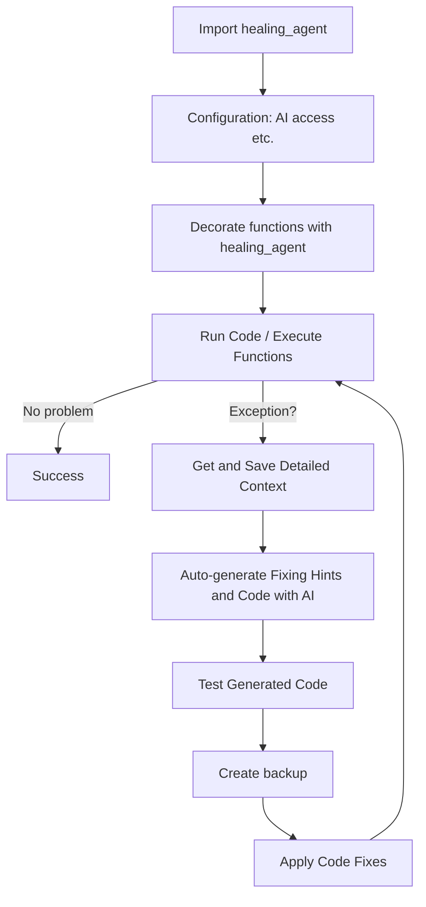

# Healing Agent 🩺

Healing Agent is a deliberately small code-healing library: decorate a Python function, and when it raises, an AI analyzes the full context, generates a fix, backs up the original, applies the repair, and re-runs your code — like [Wolverine](https://github.com/biobootloader/wolverine), with regenerative healing abilities.

**The thesis:** a thin, transparent, minimal codebase + a capable AI + strong acceptance tests can heal recurring IT failures — broken code *and* drifting data alike. Intelligence lives in the model and the prompts; trust lives in the tests.

⚠️ Not intended for production use. `AUTO_FIX` defaults to `True` to preserve the original autonomous behavior: a generated fix can modify, reload, and run supervised code. `AUTO_SYSCHANGE` defaults to `False` because it installs packages. Set `AUTO_FIX=False` for proposal-only operation. Failed healing always re-raises the original application exception.

[Video demo on Youtube](https://youtu.be/_N1G3qBO34s)

## Features ✨

- 🚨 Automatic error detection with rich context capture (source, args, variables, traceback)
- 💡 AI-generated fixing hints and repaired code, multi-provider (Azure OpenAI, OpenAI, Anthropic, Ollama, LiteLLM)
- 📊 **Data Healing**: adapts loaders to structurally drifted input while old inputs keep working (see below)
- 🔒 Secret redaction before anything is sent to a provider or written to disk
- 💾 Backups before every fix, exception context saved to JSON, optional reviewable `git apply` patches
- 🔧 Zero-config integration: import, decorate, run

## Data Healing 📊

Sometimes the code is fine but the world changed: a CSV renames or reorders its
columns, an API renests its fields, a date format flips. Healing Agent adapts
the loader so that **both the old and the new format keep working** — it does
not simply rewrite the code for the new shape.

This is live-demonstrated by acceptance tests ([tests/test_data_drift.py](tests/test_data_drift.py)),
where a scenario only passes if the healed source returns the identical
business result for the old **and** the new input:

| Scenario | Drift | Status |
|---|---|---|
| CSV renamed headers | `amount` → `osszeg` (translated headers) | ✅ healed |
| CSV reordered columns | index-based `row[2]` parsing broke | ✅ healed |
| API payload reshaped | `data.items[].name/price` → `result.records[].title/amount` | ✅ healed |
| Date format drift | `2026-01-15` → `15.01.2026` | ✅ healed |
| Error inside an undecorated helper | fix must adapt at the decorated boundary | ✅ healed |
| Excel workbook drift (3 layers) | sheet renamed + title rows above header + translated headers | ✅ healed |
| Mixed valid/invalid records | header drift healed while quarantine semantics preserved | ✅ healed |
| BOM + decimal locale | UTF-8 BOM on first header + `"1 200,50"` Hungarian numbers | ✅ healed |
| Pagination envelope | flat `items[]` → per-page `pages[].results[]`, aggregated across pages | ✅ healed |
| Required column missing entirely | must raise, not fabricate | ✅ guarded |
| Missing column + decoy numeric column | must not repurpose order numbers as amounts | ✅ guarded |

Before/after excerpt from an actual healed run (reordered-columns scenario):

```python
# before healing: hardcoded column order
total += int(row[2])

# after healing (generated): header-aware alias mapping
aliases = {"amount": ["amount", "total", "price", "value"], ...}
header_map[key] = headers.index(name)
total += int(row[header_map["amount"]])
```

**Guardrail:** when required business data is genuinely missing, the healed
code raises a clear error instead of inventing values — even when a tempting
decoy column is present. Our adversarial test caught the model summing order
numbers as amounts; two targeted prompt sentences fixed it, and the test keeps
it fixed.

The implementation is intentionally tiny: drift awareness lives in the fix and
hint prompts, correctness lives in the acceptance tests. See
[docs/data-healing.md](docs/data-healing.md) for the approach and how to extend it.

## How it works 🧠


```mermaid
graph TD
    A[Import healing_agent] --> B[Configuration: AI access etc.]
    B --> C[Decorate functions with healing_agent]
    C --> D[Run Code / Execute Functions]
    D -->|No problem| L[Success]
    D -->|Exception?| F[Get and Save Detailed Context]
    F --> G[Auto-generate Fixing Hints and Code with AI]
    G --> H[Test Generated Code]
    H --> I[Create backup]
    I --> J[Apply Code Fixes]
    J --> D
```

## Installation 💻

```bash
pip install healing-agent
```

From GitHub or source:

```bash
pip install git+https://github.com/matebenyovszky/healing-agent
# or
git clone https://github.com/matebenyovszky/healing-agent && cd healing-agent && pip install -e .
```

Anthropic and LiteLLM support are optional extras: `pip install "healing-agent[anthropic]"` or `"healing-agent[litellm]"`. Python 3.10–3.13 is supported. Note: LiteLLM currently pins OpenAI `<3`, so the LiteLLM extra resolves to the latest OpenAI 2.x.

## Usage 🔧

```python
import healing_agent

@healing_agent
def your_function():
    ...

# or override config per function:
@healing_agent(AUTO_FIX=False)
def your_function():
    ...
```

Run your script as usual. On an exception, Healing Agent captures context, generates and (by default) applies a fix, and re-executes. Context, backups, and fixes are saved next to your script in `_healing_agent_*` folders.

## Configuration ⚙️

Configuration lives in `healing_agent_config.py` — first looked up in your project directory, then in `~/.healing_agent/`. On first run a template is copied there automatically; edit it (or use environment variables, recommended for keys).

Key settings:

```python
AI_PROVIDER = "azure"     # azure | openai | anthropic | ollama | litellm

MAX_ATTEMPTS = 3          # Hard limit across recursive repair/reload attempts
DEBUG = True              # Detailed logging
AUTO_FIX = True           # Apply and execute generated fixes
AUTO_SYSCHANGE = False    # Never install packages automatically (keep False)
BACKUP_ENABLED = True     # Back up sources before fixes
RESTORE_ON_FAILURE = True # Roll the source back when healing definitively fails
SAVE_EXCEPTIONS = True    # Save exception context JSON
REDACT_SECRETS = True     # Redact secrets before AI/disk (keep True)
GIT_MODE = "off"          # off | patch (save reviewable diff) | apply (guarded git apply)
```

Provider example (Azure OpenAI):

```python
AZURE = {
    "api_key": os.getenv("AZURE_API_KEY"),   # recommended: environment variable
    "endpoint": "https://your-resource.openai.azure.com",
    "deployment_name": "gpt-4o-mini",
    "api_version": "2024-02-01",
}
```

Model IDs are configurable, not hardcoded. If a repaired module fails to load, the previous module object is restored in `sys.modules`. When healing fails definitively — `MAX_ATTEMPTS` exhausted, or the repaired module still failing — `RESTORE_ON_FAILURE=True` (the default) also rolls the **source file** back to its pre-healing state, so no half-healed code is left behind; the generated candidate stays available under `_healing_agent_fixes/`. Set it to `False` to keep the mutated file for inspection.

### Reviewable Git patches (optional)

Git is never required and nothing is ever committed or pushed. `GIT_MODE="patch"` saves each valid fix as a minimal unified diff plus a JSON provenance sidecar (repo root, source hashes, Git HEAD, language, verification state) under `_healing_agent_fixes/` — reviewable with `git apply --check`. `GIT_MODE="apply"` additionally applies the patch through Git after re-checking the source hash. The patch layer is language-neutral (`save_text_patch(...)` works for PowerShell, shell, JS, etc.); the decorator itself is Python-only.

### Automatic system changes

`AUTO_SYSCHANGE=True` pip-installs inferred missing modules with no allowlist or pinning — use only in disposable environments. It defaults to `False`.

## Testing 🧪

```bash
python -m pytest
```

Live data-healing acceptance tests skip automatically when no AI provider is configured, so CI stays green. `python scripts/overall_test.py` additionally builds and installs the package first. Maintainers: follow [RELEASING.md](RELEASING.md) before tagging.

## Roadmap 🗺️

See [ROADMAP.md](ROADMAP.md) for the path toward verified repairs, agent/LLM failure healing, and harness integrations. Runtime healing never reads or requires a GitHub token; commits, branches, and PRs remain explicit host-level steps.

## Use Cases 💡

- **Development**: catch and fix errors early, automated — this is what you would do anyway. 😁
- **Data ingestion**: keep loaders aligned with drifting sources (renamed columns, reshaped APIs) under test-enforced guardrails.
- **Education**: explore AI coding capabilities and their limits.

## Cooking open source 🍳

MIT License. Feedback and contributions are welcome!
