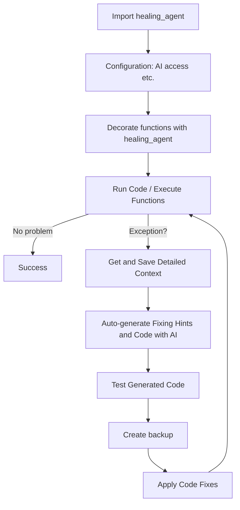

# Healing Agent 🩺

Healer Agent is an intelligent code assistant that catches with detailed context and fixes errors in your Python code. It leverages the power of AI to provide smart suggestions and corrections, helping you write more robust and "self-healing" code. Your program will be able to fix itself, it will have regenerative healing abilities like [Wolverine](https://github.com/biobootloader/wolverine). 

⚠️ Not intended for production use. To preserve Healing Agent's original autonomous behavior, `AUTO_FIX` defaults to `True`: a generated fix can modify, reload, and run supervised code. `AUTO_SYSCHANGE` remains `False` because it installs packages. Set `AUTO_FIX=False` for proposal-only operation. Failed healing always re-raises the original application exception.

Goal: first actually usable autonomous coding agent in production

[Video demo on Youtube](https://youtu.be/_N1G3qBO34s)

## Features ✨

- 🚨 Automatic error detection and handling of diverse exception types
- 💡 Smart error analysis and solution suggestions (auto-generated fixing hints and code)
- 🔍 Comprehensive error analysis including exception details, stack traces, local and globalvariables and root cause identification
- 🧠 Advanced AI-powered code healing using LLMs of different providers
- 🔧 Zero-config integration with Python projects (just import and decorate)
- 💾 Robust error tracking and debugging:
  - Exception context saved to JSON (code, error details, function info and args)
  - Automatic code backups before fixes
  - Detailed analysis results and fix history
  - Quick test of fixes
- 🤖 (Optionally) Fully automated operation with minimal human intervention
- 📦 Automatic installation of missing modules

## Flagship direction: Data Healing

The most important planned capability is **Data Healing**: keeping ingestion
code aligned with changing, but still business-valid, source documents.

Examples include:

- an Excel workbook renames or reorders columns, moves the header row, changes
  a sheet name, adds merged cells, or uses a different date/decimal format;
- a PDF keeps the same business information but moves a table, changes its
  headings or layout, or requires a different extraction strategy;
- extracted rows no longer match the target Pydantic model even though the
  required information is still present under slightly different names or
  structures.

Healing Agent should profile the failing and previously valid samples, compare
them with the declared Pydantic/data contract, and propose the smallest
versioned change to the loader or a new boundary adapter. It should then replay
both sample sets, validate business invariants, and return the code diff,
mapping explanation, fixtures, and confidence evidence. It must not silently
relax the canonical model, invent required values, or overwrite the original
document. Shadow mode and human approval will be available as optional policies
alongside the default automatic activation path.

This capability is planned, not implemented in 0.2.9. See the dedicated
[Data Healing roadmap](ROADMAP.md#flagship-data-healing) for incremental steps.

Data Healing is intentionally framework-level. The core package does not
depend on Docling, Fidelis, Pydantic, pandas, or a particular business domain.
It can inspect and repair the code at an ingestion boundary whenever that code
raises an exception or fails a configured validation. Pydantic models and
document/data extractors can be supplied by an application or a future
optional adapter.

## How it works 🧠


```mermaid
graph TD
    A[Import healing_agent] --> B[Configuration: AI access etc.]
    B --> C[Decorate functions with healing_agent]
    C --> D[Run Code / Execute Functions]
    D -->|No problem| L[Success]
    D -->|Exception?| F[Get and Save Detailed Context]
    F --> G[Auto-generate Fixing Hints and Code with AI]
    G --> H[Test Generated Code]
    H --> I[Create backup]
    I --> J[Apply Code Fixes]
    J --> D
```

## Installation 💻

To install Healing Agent, follow these steps:

From PyPI:

```bash
pip install healing-agent
```

PIP package from GitHub:

```bash
pip install git+https://github.com/matebenyovszky/healing-agent
```

OR from source:

1. Clone the repository:
   ```bash
   git clone https://github.com/matebenyovszky/healing-agent.git
   ```

2. Navigate to the project directory:
   ```bash
   cd healing-agent
   ```

3. Install:
   ```bash
   pip install -e .
   ```
   OR run overall test to install and test functionality:
   ```bash
   python scripts/overall_test.py
   ```

## Usage 🔧

To use Healing Agent in your project, follow these steps:

1. Import the `healing_agent` decorator in your Python file:
   ```python
   import healing_agent
   ```

2. Decorate the function you want to monitor with `@healing_agent`:
   ```python
   @healing_agent
   def your_function():
       # Your code here
   ```
   You can also pass parameters to the decorator to change the behavior set in the config file:
   ```python
   @healing_agent(AUTO_FIX=False)
   def your_function():
       # Your code here
   ```

3. Run your Python script as usual. Healing Agent will automatically detect, save context and attempt to fix any errors that occur within the decorated function.

Context (and code file backup in case of auto-fix) is saved to a JSON/Python file in the same directory as your script with actual timestamp in the filename.

## Configuration ⚙️

Healing Agent uses a flexible configuration system that supports multiple AI providers and customizable settings. The configuration is managed through a `healing_agent_config.py` file, which can be located in two places:

1. **Local Project Directory**: Healing Agent first checks for a config file in your project's directory
2. **User Home Directory**: If no local config is found, it looks for `~/.healing_agent/healing_agent_config.py`

### Configuration File Creation

The configuration file is automatically created in one of two ways:

1. **Auto-Creation**: When you first run Healing Agent, if no configuration file exists, it will:
   - Create a `.healing_agent` directory in your home folder
   - Copy the template configuration to `~/.healing_agent/healing_agent_config.py`
   - Print a message indicating where the new config file was created

2. **Manual Creation**: You can manually create the configuration file:
   - Copy `healing_agent/config_template.py` from the package
   - Rename it to `healing_agent_config.py`
   - Place it in either your project directory or `~/.healing_agent/`
   - Update the AI provider settings and other options

### Configuration Options

The configuration file includes:

1. **AI Provider Selection**: Choose from supported providers:
   - OpenAI
   - Azure OpenAI
   - LiteLLM
   - Anthropic
   - Ollama

2. **Provider Credentials**: Set up API keys and endpoints
   - Can be defined directly in the config file
   - Can be loaded from environment variables (recommended)

3. **Behavior Settings**:
   ```python
   MAX_ATTEMPTS = 3       # Hard limit across recursive repair/reload attempts
   DEBUG = True           # Enable detailed logging
   AUTO_FIX = True          # Apply and execute generated fixes by default
   AUTO_SYSCHANGE = False   # Never install packages automatically by default
   BACKUP_ENABLED = True    # Create backups before fixes
   SAVE_GIT_PATCHES = False # Optionally save a reviewable unified diff
   GIT_MODE = "off"          # "off", "patch", or guarded "apply"
   GIT_PATCH_DIR = None       # Optional patch/provenance directory
   GIT_STAGE = False          # Stage only when GIT_MODE="apply"
   ```

`MAX_ATTEMPTS` counts repair cycles for the same decorated function, including
calls reached after a repaired module is reloaded. For example, a value of `3`
allows at most three generated-and-applied repair attempts. It is not a general
retry setting for every provider or network error; those failures stop healing
and the original application exception is raised.

If a repaired module cannot be loaded or its top-level code fails, Healing Agent
restores the previous module object in `sys.modules`. This protects the running
process, but does not revert the edited source file. Keep `BACKUP_ENABLED=True`
and use version control so source changes remain recoverable.

### Reviewable Git patches

Git is optional. The core decorator works without a repository and never
commits, pushes, or needs a GitHub token. Set `GIT_MODE="patch"` to save each
valid generated replacement as a minimal unified diff plus a JSON provenance
sidecar under `_healing_agent_fixes/`. The artifact records the repository
root, relative path, source hashes, Git HEAD, language, and verification state.
It can be reviewed or checked with `git apply --check <file.patch>`.

`SAVE_GIT_PATCHES=True` remains a backwards-compatible alias for
`GIT_MODE="patch"`. For a locally guarded application, use
`GIT_MODE="apply"`; Healing Agent first checks the patch, confirms that the
source hash is unchanged, and then runs `git apply`. It never commits or pushes
automatically. `GIT_STAGE=True` may be used to stage the applied file, but is
off by default.

The patch layer is text- and language-neutral. Python uses the decorator's AST
replacement adapter; a PowerShell, JavaScript, shell, or other adapter can call
`save_text_patch(path, original_source, candidate_source, language="powershell")`
and receive the same diff, metadata, hash check, and apply behavior. The
decorator itself remains Python-only until language adapters are added.

Patch generation is independent of `AUTO_FIX`: with the default
`AUTO_FIX=True`, it is an audit artifact for the automatically applied
candidate; with `AUTO_FIX=False`, it is a proposal that leaves the source file
unchanged. A generated patch is not evidence that tests passed: the JSON
sidecar records patch verification separately from test evidence. Commits,
branches, pushes, and draft-PR publication remain explicit host-level steps.

### Automatic system changes

`AUTO_SYSCHANGE=True` currently recognizes missing-module errors and invokes
the active interpreter as `python -m pip install <inferred-package>`. It has no
package allowlist, version pinning, approval step, or package-confusion defense,
so it should only be used in a disposable development environment. It defaults
to `False`; the roadmap replaces direct installation with a reviewable,
policy-controlled dependency proposal.

Example configuration for Azure OpenAI:
```python
AI_PROVIDER = "azure"

AZURE = {
    "api_key": os.getenv("AZURE_API_KEY"),  # Recommended: use environment variable
    "endpoint": "https://your-resource.openai.azure.com",
    "deployment_name": "gpt-4",
    "api_version": "2024-02-01"
}
```

The model name is configurable and is not restricted to a hard-coded list. The OpenAI example defaults to `gpt-5.6-terra`, while Azure uses your deployment name. Provider/model combinations still need a published compatibility test matrix; see the [roadmap](ROADMAP.md).

Anthropic and LiteLLM support are optional extras (`pip install
"healing-agent[anthropic]"` or `pip install "healing-agent[litellm]"`). The
current LiteLLM extra requires Python 3.10 or newer; the package supports
Python 3.10–3.13. The 0.2.9 dependency baselines are OpenAI 2.20.0,
Anthropic 0.121.0, LiteLLM 1.96.2, HTTPX 0.28.1, and Requests 2.34.2, with
compatible updates allowed inside the declared major range. A normal install
currently resolves to OpenAI 3.0.0. LiteLLM 1.96.2 requires OpenAI
`>=2.20,<3`, so installing the LiteLLM extra intentionally resolves to the
latest compatible OpenAI 2.x instead; the two latest releases cannot coexist
until LiteLLM adds OpenAI 3 support.

## Testing 🧪

Run the isolated regression suite with:

```bash
python -m pytest
```

`python scripts/test_runner.py` is an equivalent wrapper and returns pytest's failing exit status. `python scripts/overall_test.py` additionally builds and installs the package before running the tests.

Maintainers should follow the guarded [release checklist](RELEASING.md) before
creating a version tag or publishing to PyPI.

## Roadmap 🗺️

See [ROADMAP.md](ROADMAP.md) and the [Data Healing design](docs/data-healing.md)
for small release steps toward verified repair, LLM and agent failure recovery,
harness integrations such as Hermes Agent, and a language-neutral repair
coordinator.

Healing Agent can emit a local, reviewable Git patch, but does not currently
create commits, push branches, or connect runtime failures to GitHub issues and
pull requests. The runtime therefore does not read or require a GitHub token.

For the future GitHub integration, a token would be supplied by the host
environment (for example an Actions secret or a fine-grained PAT), never by
the repaired application or the LLM context. It would need narrowly scoped
repository permissions such as `contents:write` and `pull_requests:write`
(and `issues:write` only when issue creation is enabled). A token by itself is
not proof that a fix is safe: the integration must apply the patch on an
isolated branch, run `git apply --check`, execute configured tests, commit and
push only after policy approval, and then open a draft PR. That flow is planned
for the roadmap; 0.2.9 provides the local guarded patch workflow.

## Use Cases 💡

- **Development**: Use Healing Agent during development to catch and fix errors early, and let AI generate fixes for your code. This is what you would do anyways, but now it's automated. 😁
- **Educational Tool**: Use Healing Agent as a learning tool to understand AI coding capabilities and limitations.

## Cooking open source 🍳

Healing Agent is distributed under the MIT License. See `LICENSE` for more information. Feedback and contributions are welcome!
