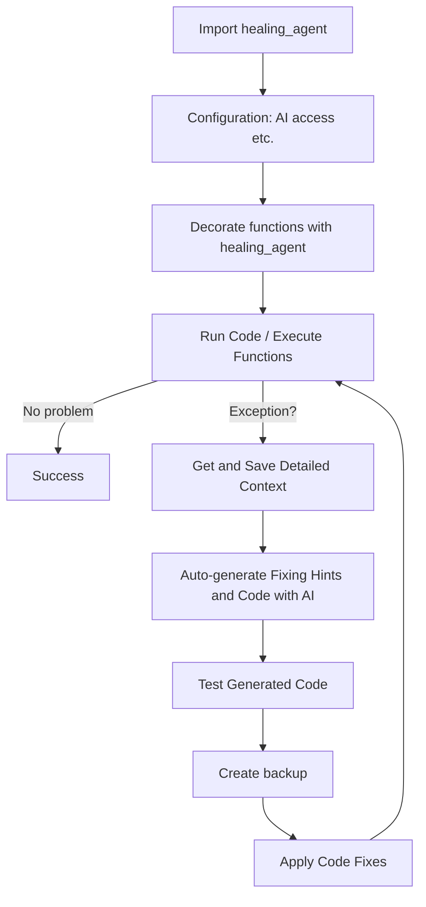

# Healing Agent

Retry libraries re-run the same broken function. Healing Agent rewrites the decorated function, checks the candidate, and re-runs the repaired code.

```bash
pip install healing-agent
```

[Video demo](https://youtu.be/_N1G3qBO34s)

Healing Agent is a deliberately small code-healing library: decorate a Python function, and when it raises, an AI analyzes the full context, generates a fix, backs up the original, applies the repair, and re-runs your code — like [Wolverine](https://github.com/biobootloader/wolverine), with regenerative healing abilities.

**The thesis:** a thin, transparent, minimal codebase + a capable AI + strong acceptance tests can heal recurring IT failures — broken code *and* drifting data alike. Intelligence lives in the model and the prompts; trust lives in the tests.

⚠️ Not intended for production use. `AUTO_FIX` defaults to `True` to preserve the original autonomous behavior: a generated fix can modify, reload, and run supervised code. `AUTO_SYSCHANGE` defaults to `False` because it installs packages. Set `AUTO_FIX=False` for proposal-only operation. Failed healing always re-raises the original application exception.

## Features ✨

- 🚨 Automatic error detection with rich context capture (source, args, variables, traceback)
- 💡 AI-generated fixing hints and repaired code, multi-provider (Azure OpenAI, OpenAI, Anthropic, Ollama, LiteLLM)
- 📊 **Data Healing**: adapts loaders to structurally drifted input while old inputs keep working (see below)
- 🔎 **Observation without a failure**: `capture()` snapshots variables at any point, and an optional ring buffer feeds your own recent log records into the repair context
- 🙋 **Ask for a repair, don't wait for a crash**: call `request_healing(reason)` from a handled error branch
- 🎫 **GitHub escalation**: a failure it could not repair opens an issue in your own repository, deduplicated, so the attempt is never lost
- 🧩 **Methods too**: definitions are found by qualname, so class methods heal like plain functions (nested functions excepted, and refused explicitly)
- ⚡ **`async def` works the same way**: coroutine functions are healed by the same session, not a parallel one
- 📝 **Inherits your logging**: output goes to the standard `healing_agent` logger, so your level, handlers and formatters apply — and prints as before if you configured none
- 🔒 Secret redaction before anything is sent to a provider or written to disk
- 💾 Backups before every fix, exception context saved to JSON, optional reviewable `git apply` patches
- 🔧 Zero-config integration: import, decorate, run

## Data Healing 📊

Sometimes the code is fine but the world changed: a CSV renames or reorders its
columns, an API renests its fields, a date format flips. Healing Agent adapts
the loader so that **both the old and the new format keep working** — it does
not simply rewrite the code for the new shape.

This is live-demonstrated by acceptance tests ([tests/test_data_drift.py](tests/test_data_drift.py)),
where a scenario only passes if the healed source returns the identical
business result for the old **and** the new input:

| Scenario | Drift | Status |
|---|---|---|
| CSV renamed headers | `amount` → `osszeg` (translated headers) | ✅ healed |
| CSV reordered columns | index-based `row[2]` parsing broke | ✅ healed |
| API payload reshaped | `data.items[].name/price` → `result.records[].title/amount` | ✅ healed |
| Date format drift | `2026-01-15` → `15.01.2026` | ✅ healed |
| Error inside an undecorated helper | fix must adapt at the decorated boundary | ✅ healed |
| Excel workbook drift (3 layers) | sheet renamed + title rows above header + translated headers | ✅ healed |
| Mixed valid/invalid records | header drift healed while quarantine semantics preserved | ✅ healed |
| BOM + decimal locale | UTF-8 BOM on first header + `"1 200,50"` Hungarian numbers | ✅ healed |
| Pagination envelope | flat `items[]` → per-page `pages[].results[]`, aggregated across pages | ✅ healed |
| Required column missing entirely | must raise, not fabricate | ✅ guarded |
| Missing column + decoy numeric column | must not repurpose order numbers as amounts | ✅ guarded |

Before/after excerpt from an actual healed run (reordered-columns scenario):

```python
# before healing: hardcoded column order
total += int(row[2])

# after healing (generated): header-aware alias mapping
aliases = {"amount": ["amount", "total", "price", "value"], ...}
header_map[key] = headers.index(name)
total += int(row[header_map["amount"]])
```

**Guardrail:** when required business data is genuinely missing, the healed
code raises a clear error instead of inventing values — even when a tempting
decoy column is present. Our adversarial test caught the model summing order
numbers as amounts; two targeted prompt sentences fixed it, and the test keeps
it fixed.

### With a schema contract (Pydantic, jsonschema, anything that raises)

If your application already declares what the data should look like, hand that
declaration to the repair. A validation failure becomes a repair request, and
the model gets the contract itself as evidence — not just the symptom:

```python
class SalesRow(BaseModel):        # your contract, written for your own sake
    customer: str
    amount: int

@healing_agent
def load_sales(rows):
    try:
        parsed = [SalesRow(**row) for row in rows]
    except ValidationError as error:
        healing_agent.request_healing(
            "rows do not satisfy the SalesRow contract",
            details={
                "contract": SalesRow.model_json_schema(),
                "validation_errors": error.errors(),
                "row_sample": rows[0],
            },
        )
    return {"total": sum(r.amount for r in parsed)}
```

Feed it `[{"ugyfel": "Alfa Kft", "osszeg": "1200"}, ...]` — Hungarian headers,
amounts as strings, contract violated — and the generated repair maps the
headers instead of weakening the model:

```python
alias_mapping = {'ugyfel': 'customer', 'ügyfél': 'customer',
                 'osszeg': 'amount',   'összeg': 'amount'}

def normalize_key(k):                    # lowercase, trim, strip diacritics
    ...

if expected_key in mapped:               # ambiguous mapping: refuse, don't guess
    raise ValueError(f"Duplicate mapped key '{expected_key}' in row: {row}")
```

Note what it did and did not do: it added both the accented and unaccented
alias, it refuses an ambiguous mapping rather than inventing a value, and it
never touched `SalesRow`. The loader adapts; the contract stays authoritative.
Both the drifted and the original format return the same result afterwards.

This needs no support from Healing Agent beyond what is shown — any validator
that raises works, because the contract and the errors travel as ordinary
`details`.

The implementation is intentionally tiny: drift awareness lives in the fix and
hint prompts, correctness lives in the acceptance tests. See
[docs/data-healing.md](docs/data-healing.md) for the approach and how to extend it.

## How it works 🧠


```mermaid
graph TD
    A[Import healing_agent] --> B[Configuration: AI access etc.]
    B --> C[Decorate functions with healing_agent]
    C --> D[Run Code / Execute Functions]
    D -->|No problem| L[Success]
    D -->|Exception?| F[Get and Save Detailed Context]
    F --> G[Auto-generate Fixing Hints and Code with AI]
    G --> H[Test Generated Code]
    H --> I[Create backup]
    I --> J[Apply Code Fixes]
    J --> D
```

## Where this fits 🧭

Healing Agent is a **maintained successor to [Wolverine](https://github.com/biobootloader/wolverine)** — the project that demonstrated LLM-driven self-healing and then stopped: no commit since March 2024, 27 open issues and 10 unmerged pull requests, no published package. Its issue tracker reads as a list of things this project already does:

| Asked for in Wolverine | Healing Agent |
|---|---|
| [#52](https://github.com/biobootloader/wolverine/issues/52), [#41](https://github.com/biobootloader/wolverine/issues/41) — an installable, system-wide package | `pip install healing-agent`, Python 3.10–3.13 |
| [#1](https://github.com/biobootloader/wolverine/issues/1) — get the failing function's variable values into the prompt | context capture includes `function_arguments`, `locals` and `traceback_frames` by default |
| [#40](https://github.com/biobootloader/wolverine/issues/40) — validate that a fix really changes something, to prevent loops | bounded attempts (`MAX_ATTEMPTS`) plus `compile()` and single-function AST checks before a candidate is accepted |
| [#23](https://github.com/biobootloader/wolverine/issues/23) — better error handling, do not apply blindly | `AUTO_FIX=False` proposal-only mode, `RESTORE_ON_FAILURE` rollback, and the original exception always re-raised |
| [#19](https://github.com/biobootloader/wolverine/issues/19) — GitHub Actions integration | planned as the `pr-checks` verify gate and `APPLY="pr"` ([ROADMAP.md](ROADMAP.md)) |

Wolverine rewrote a whole script through line-numbered JSON edit operations; Healing Agent replaces exactly one decorated function, backs it up first, and restores it when healing fails.

**Why the codebase stays small.** [Agentless](https://github.com/OpenAutoCoder/Agentless) reported that a fixed localize → repair → validate pipeline — no agent loop, no tool-choosing LLM — outperformed the open-source software agents on SWE-bench Lite (32.00%) at roughly $0.70 per issue. That is external evidence for the thesis above: complexity belongs in verification, not in scaffolding.

**Not a CI healer — the inverse.** "CI went red, let an agent fix it and open a PR" is a crowded space, and coding agents are on home ground there: CI hands them a repository, a diff and a log. None of them can see the running process. Healing Agent's ground is the 02:00 scheduled job — no pull request, no reviewer, no agent watching, just an exception and the values that were in memory when it happened. CI is not what we repair, it is what we *verify against*: the repository's own test suite is the gate a runtime-derived fix has to pass ([docs/apply-verify-design.md](docs/apply-verify-design.md)).

**Compared to hosted products.** [Sentry Seer Autofix](https://sentry.io/product/seer/autofix/) solves the neighbouring problem commercially, and solves it well: production telemetry in, root cause and a pull request out. It is a hosted service, though, and your errors have to reach it. Healing Agent is MIT-licensed, runs inside your own process with your own provider (Azure OpenAI, OpenAI, Anthropic, Ollama, LiteLLM), redacts secrets before anything leaves the machine, and needs no backend at all. It also sees what a telemetry pipeline cannot: the actual argument and local-variable values at the moment of the failure.

## Installation 💻

```bash
pip install healing-agent
```

From GitHub or source:

```bash
pip install git+https://github.com/matebenyovszky/healing-agent
# or
git clone https://github.com/matebenyovszky/healing-agent && cd healing-agent && pip install -e .
```

Anthropic and LiteLLM support are optional extras: `pip install "healing-agent[anthropic]"` or `"healing-agent[litellm]"`. Python 3.10–3.13 is supported. Note: LiteLLM currently pins OpenAI `<3`, so the LiteLLM extra resolves to the latest OpenAI 2.x.

## Usage 🔧

```python
import healing_agent

@healing_agent
def your_function():
    ...

# or override config per function:
@healing_agent(AUTO_FIX=False)
def your_function():
    ...
```

Run your script as usual. On an exception, Healing Agent captures context, generates and (by default) applies a fix, and re-executes. Context, backups, and fixes are saved next to your script in `_healing_agent_*` folders.

### Asking for a repair without a crash

Not every failure worth repairing arrives as an exception. A loader usually *detects* the problem itself — a column is missing, a payload has the wrong shape — and handles it in an `if`. That branch can ask for a repair directly:

```python
@healing_agent
def load_sales(rows):
    if "amount" not in rows[0]:
        healing_agent.request_healing(
            "input has no 'amount' column; the value is present under a different header",
            details={"headers_seen": sorted(rows[0])},
        )
    return sum(int(row["amount"]) for row in rows)
```

There is no second pipeline behind this: `request_healing` raises `HealingRequested`, the decorator catches it like any other exception, and context capture, redaction, the fix prompt, the verify gates, apply, rollback and escalation all behave as they already do. What changes is what the model is told — that the program asked deliberately, and *why*. An exception says where execution stopped; a reason says what was expected.

If healing succeeds, the repaired function's result is returned to your caller. If it does not, `HealingRequested` propagates: a program that asked a question deserves to hear that it went unanswered, rather than receiving a silent `None`.

### Methods, not just functions

The decorator works the same on a method as on a plain function:

```python
class SalesLoader:
    def __init__(self, factor):
        self.factor = factor

    @healing_agent
    def load(self, rows):
        return sum(row["amount"] for row in rows) * self.factor
```

Definitions are located by `__qualname__`, so `SalesLoader.load` is never confused with a module-level `load`, nested classes work, and the repair is written back at the class's own indentation without touching the rest of the file.

Two limits worth knowing:

- **Functions defined inside other functions cannot be healed.** They exist only while the enclosing call runs, so a reloaded module has nothing to verify against. Healing Agent detects this and refuses *before* touching your source; the generated candidate is still saved under `_healing_agent_fixes/` if you want it.
- The repaired method is re-run with the instance that was already in flight. Attribute access works; a method that depends on the *identity* of its class (`type(self) is ...`) sees the pre-reload class.

### Healing async functions

`async def` functions are decorated exactly like synchronous ones:

```python
@healing_agent
async def fetch_sales(session, url):
    payload = await (await session.get(url)).json()
    return sum(int(row["amount"]) for row in payload["rows"])
```

The decorator detects a coroutine function and returns an async wrapper for it. The healing session — attempt budget, backup, verify gates, apply, rollback, escalation — is the same code in both cases; only the calls back into your own function are awaited.

### Where Healing Agent's own output goes

Healing Agent logs to the standard logger `healing_agent`, which it never configures. Your application's level, handlers, formatters and filters therefore apply to its messages through the normal logger hierarchy — including loguru via its documented `InterceptHandler`, or structlog, since both wrap stdlib `logging`. No logging dependency is added.

```python
import logging
logging.basicConfig(level=logging.INFO)   # healing output now follows your setup
logging.getLogger("healing_agent").setLevel(logging.WARNING)  # ...or quieten just this
```

If your application configured no logging at all, the rich console narration is printed as before. `LOG_MODE` in the config file makes the choice explicit:

| `LOG_MODE` | Behavior |
|---|---|
| `auto` (default) | logger when your application configured logging, console when it did not |
| `logging` | always the logger |
| `print` | always the console, whatever your application configured |

> **Upgrading:** if your application *does* configure logging, its configuration now governs Healing Agent's output too — an app set to `WARNING` will no longer show the `INFO` narration. Set `LOG_MODE = "print"` to keep the console behavior of earlier releases.

### Observing without a failure

The same evidence that powers a repair is useful on its own — knowing every variable at the moment an API call returned something unexpected is often the whole debugging session:

```python
response = requests.get(url)
healing_agent.capture("supplier response")   # redacted snapshot, no AI call, no mutation
```

Snapshots land in `_healing_agent_captures/` next to the calling module (or `CAPTURE_DIR`). Secret redaction applies here too, and capturing never raises into your program.

Optionally, Healing Agent can also keep the last N of your **own log records** and include them in the repair context — the stack trace says where the program broke, the log says what it was doing:

```python
LOG_BUFFER_SIZE = 50          # in your config; 0 or absent = never installed
```

```python
healing_agent.enable_log_capture()   # arm it at startup, while the program is healthy
```

A ring buffer can only hold what was recorded *before* the failure, so it has to be armed early; `healing_agent.disable_log_capture()` removes it again. Records are level-filtered (`LOG_BUFFER_LEVEL`) and individually length-capped, and lowering `LOG_BUFFER_SIZE` immediately lowers how many are sent.

⚠️ Log messages are free text, so name-based redaction cannot see inside them — `logger.info(f"token={t}")` would reach the provider. Keep it off unless you trust your log messages.

**What is *not* sent:** the captured `variables` block (locals and globals — about 2.5 KB of a typical 8 KB context) is saved to disk but deliberately never included in a prompt, because it would roughly double the ~990-token fix prompt on every nested attempt. Giving the model tools to *request* specific variables or log lines instead is [ROADMAP](ROADMAP.md) item 7.

## What evidence goes where 🧾

The same failure context travels to three places with very different economics: an artifact on disk that you may search months later, a prompt paid for by the token on every nested repair attempt, and a GitHub issue with a hard size limit that a human has to read.

**Redaction is not what varies.** One policy runs before anything leaves the capture — names *and* value shapes — so the evidence is equally safe in all three. A destination only chooses how much of it is worth carrying:

```python
EVIDENCE = {
    "disk":     {"arguments": 3000, "variables": 3000, "environment": 3000, "logs": 500},
    "provider": {"arguments": 1000, "variables": 400,  "environment": 300,  "logs": 50},
    "issue":    {"arguments": 300,  "variables": 300,  "environment": 300,  "logs": 50},
}
```

A number includes the section with that limit; `0` or a missing key leaves it out — and leaves it *absent* rather than empty, so a reader can tell "not collected" from "collected and empty". The unit differs because the useful unit differs:

| Section | Unit |
|---|---|
| `variables`, `environment`, `arguments` | characters **per value** — every entry is kept and trimmed on its own, so one huge dataframe cannot push the rest of the state out of the report |
| `logs` | number of most recent **lines** |

The error, the traceback and the function's own source are never optional: a repair prompt without the source cannot produce a repair.

Why this matters in practice — measured on a real captured context, changing only the policy:

| Provider policy | Prompt |
|---|---|
| defaults | ~2600 tokens |
| `{"environment": 0}` | ~1600 tokens |
| `{"environment": 0, "variables": 100, "logs": 10}` | ~1270 tokens |

The environment is the expensive section and the least useful *to the model*, while being invaluable to a **human** reading an escalated issue — which is exactly why the destinations are configured separately.

**Environment capture is an allowlist.** `ENVIRONMENT_VARS` names the variables you want; nothing else is read. A denylist can only mask the secret shapes it already knows, so a bespoke secret under a harmless name would travel — naming what you want inverts that. The name and value filters still run on top, so an allowlisted `DATABASE_URL` keeps its host and path while its password is masked.

## When healing fails: escalate to GitHub 🎫

A failure Healing Agent cannot repair should not vanish into a log. With one setting it opens an issue in your application's own repository, so the attempt becomes work a person — or an issue→PR agent — can pick up:

```python
GITHUB = {
    "repo": None,                    # "owner/name"; None = detect from the git remote
    "token_env": "GITHUB_TOKEN",     # NAME of the env var holding the token, never the value
    "issue_on_failure": True,
    "issue_detail": "reference",     # reference | redacted | ai-anonymized
}
```

The issue carries the error type and message, the function, the repository-relative location, the failing line, and the analysis Healing Agent generated. The original exception still propagates — an opened issue is never treated as a fix.

**Deduplication.** A job failing every minute must not open 1440 issues. Each issue carries an invisible fingerprint built from the exception type, the function, the repository-relative path, the failing line's *text* (not its number, which shifts on every edit) and the message with digits normalised — so `row 5 failed` and `row 812 failed` are one issue, while `KeyError: 'amount'` and `KeyError: 'osszeg'` stay separate, because two drifted columns are two problems. A repeat occurrence finds the open issue and adds nothing.

**How much leaves the machine is your choice:**

| `issue_detail` | The issue contains |
|---|---|
| `reference` (default) | identity and pointers to the local artifacts — no captured values are uploaded, though note the exception *message* is included, and `KeyError: 'customer_tax_id'` is itself a disclosure |
| `redacted` | additionally the redacted context JSON (arguments, locals, traceback) |
| `ai-anonymized` | additionally a context JSON where an extra AI pass replaced values with placeholders |

On an internal repository the richer levels are a gift rather than a risk, which is why all three exist instead of one cautious default.

**The token is never in your config file.** `token_env` names the environment variable that holds it, and `gh` CLI authentication is used as a fallback. `healing_agent_config.py` stays free of secrets.

## Configuration ⚙️

Configuration lives in `healing_agent_config.py` — first looked up in your project directory, then in `~/.healing_agent/`. On first run a template is copied there automatically; edit it (or use environment variables, recommended for keys).

Key settings:

```python
AI_PROVIDER = "azure"     # azure | openai | anthropic | ollama | litellm

MAX_ATTEMPTS = 3          # Hard limit across recursive repair/reload attempts
DEBUG = True              # Detailed logging
AUTO_FIX = True           # Apply and execute generated fixes
AUTO_SYSCHANGE = False    # Never install packages automatically (keep False)
BACKUP_ENABLED = True     # Back up sources before fixes
RESTORE_ON_FAILURE = True # Roll the source back when healing definitively fails
SAVE_EXCEPTIONS = True    # Save exception context JSON
REDACT_SECRETS = True     # Redact secrets before AI/disk (keep True)

# Which environment variables to capture — an allowlist, not a filter
ENVIRONMENT_VARS = ["APP_ENV", "TZ", "CI"]

# Evidence: what each destination carries, and how much (see below)
EVIDENCE = {
    "disk":     {"arguments": 3000, "variables": 3000, "environment": 3000, "logs": 500},
    "provider": {"arguments": 1000, "variables": 400,  "environment": 300,  "logs": 50},
    "issue":    {"arguments": 300,  "variables": 300,  "environment": 300,  "logs": 50},
}
GIT_MODE = "off"          # off | patch (save reviewable diff) | apply (guarded git apply)

# Verification gates: run before the live file changes, exit code 0 accepts
VERIFY_COMMAND = None     # e.g. ["python", "checks/verify_loader.py"]; list of lists = ordered gates
                          # runs on a copy of the candidate FILE, so use a self-contained checker
VERIFY_TIMEOUT_SECONDS = 120

# Observation (see "Observing without a failure" above)
LOG_BUFFER_SIZE = 0       # 0 or absent = ring buffer never installed; N = keep and send N records
LOG_BUFFER_LEVEL = "INFO" # Minimum level the buffer records
LOG_MODE = "auto"         # auto | logging | print - where Healing Agent's OWN messages go
CAPTURE_DIR = None        # Where capture() writes; None = next to the calling module
```

Provider example (Azure OpenAI):

```python
AZURE = {
    "api_key": os.getenv("AZURE_API_KEY"),   # recommended: environment variable
    "endpoint": "https://your-resource.openai.azure.com",
    "deployment_name": "gpt-4o-mini",
    "api_version": "2024-02-01",
}
```

Model IDs are configurable, not hardcoded. If a repaired module fails to load, the previous module object is restored in `sys.modules`. When healing fails definitively — `MAX_ATTEMPTS` exhausted, or the repaired module still failing — `RESTORE_ON_FAILURE=True` (the default) also rolls the **source file** back to its pre-healing state, so no half-healed code is left behind; the generated candidate stays available under `_healing_agent_fixes/`. Set it to `False` to keep the mutated file for inspection.

### Sampling parameters and comparing models

Every provider block takes an optional `params` dict, forwarded to that provider **verbatim** — request keyword arguments for Azure, OpenAI, Anthropic and LiteLLM, and Ollama's `options` object for local models. Nothing is validated or translated: parameter names belong to the provider. Leave it empty and the request is exactly what earlier releases sent.

```python
OLLAMA = {
    "host": os.getenv("OLLAMA_HOST", "http://localhost:11434"),
    "model": os.getenv("OLLAMA_MODEL", "qwen2.5-coder:7b"),
    "timeout": 300,                       # local models are slower than APIs
    "params": {"temperature": 0.2, "seed": 7, "num_ctx": 8192},
}
```

`AI_PROVIDER` reads `HEALING_AGENT_PROVIDER` from the environment, so the same config can be swept across providers without being edited:

```bash
HEALING_AGENT_PROVIDER=ollama OLLAMA_MODEL=qwen2.5-coder:32b python -m pytest tests/test_data_drift.py -v
```

With `DEBUG = True` each healing session reports what it spent — `♣ Model usage: 3 model call(s), 41.2s, tokens in/out: 5120/860` — and the same summary is written into the saved fix artifact. Only counts are recorded, never prompts. If a repair fails on a small local model, rule out a too-small `num_ctx` (which truncates the captured evidence silently) before concluding the model cannot do it. See [docs/benchmark.md](docs/benchmark.md) for the planned model × parameter × prompt matrix.

### Reviewable Git patches (optional)

Git is never required and nothing is ever committed or pushed. `GIT_MODE="patch"` saves each valid fix as a minimal unified diff plus a JSON provenance sidecar (repo root, source hashes, Git HEAD, language, verification state) under `_healing_agent_fixes/` — reviewable with `git apply --check`. `GIT_MODE="apply"` additionally applies the patch through Git after re-checking the source hash. The patch layer is language-neutral (`save_text_patch(...)` works for PowerShell, shell, JS, etc.); the decorator itself is Python-only.

### Automatic system changes

`AUTO_SYSCHANGE=True` pip-installs inferred missing modules with no allowlist or pinning — use only in disposable environments. It defaults to `False`.

## Testing 🧪

```bash
python -m pytest
```

Live data-healing acceptance tests skip automatically when no AI provider is configured, so CI stays green. `python scripts/overall_test.py` additionally builds and installs the package first. Maintainers: follow [RELEASING.md](RELEASING.md) before tagging.

## Roadmap 🗺️

See [ROADMAP.md](ROADMAP.md) for the path toward verified repairs, agent/LLM failure healing, and harness integrations. Runtime healing never reads or requires a GitHub token; commits, branches, and PRs remain explicit host-level steps.

## Use Cases 💡

- **Development**: catch and fix errors early, automated — this is what you would do anyway. 😁
- **Data ingestion**: keep loaders aligned with drifting sources (renamed columns, reshaped APIs) under test-enforced guardrails.
- **Education**: explore AI coding capabilities and their limits.

## Cooking open source 🍳

MIT License. Feedback and contributions are welcome!
